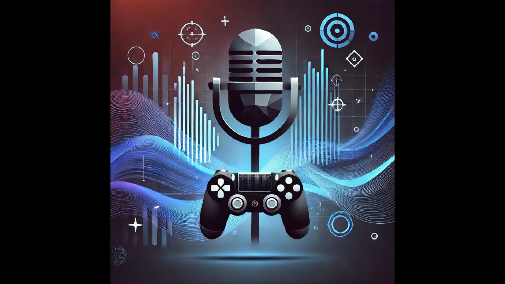

# Projeto Podcast Gerado por I.A

Projeto com o objetivo de gerar um podcast utilizando ferramentas de IA através de prompts mais trabalhados.

# Ouça o podcast aqui 
[Link para o Podcast](https://youtu.be/wj8drDRNjOA)

## 💻 Tecnologias utilizadas no projeto

- ChatGPT
- Google NotebookLM
- Suno
- Capcut

## ✨ Como foi feito ?

- Roteiro e capa gerado via chatgpt
- Falas geradas pelo Google NotebookLM
- Música gerada pelo Suno
- Capcut para unir e editar
